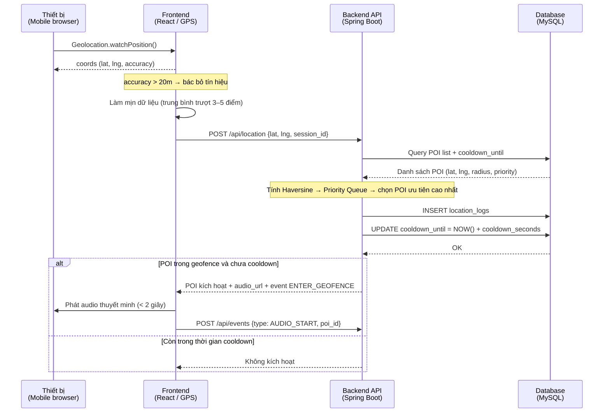
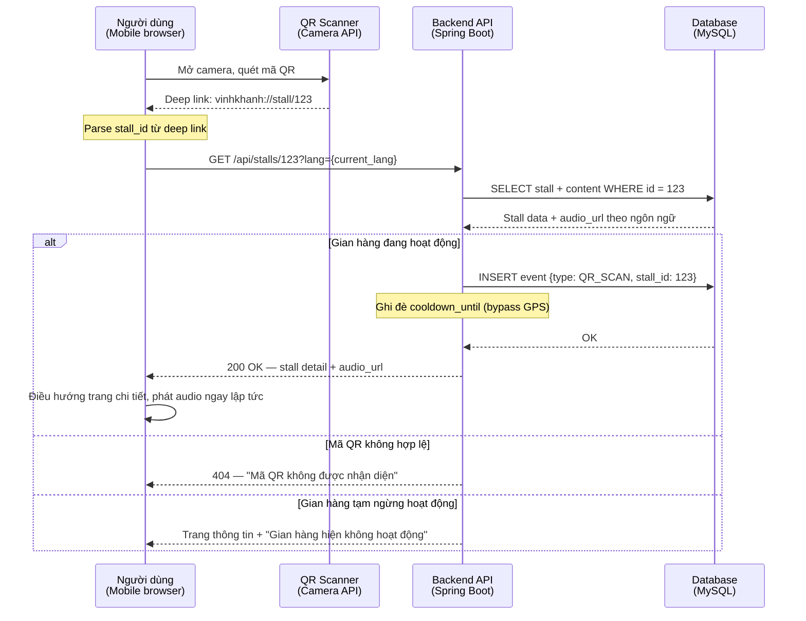
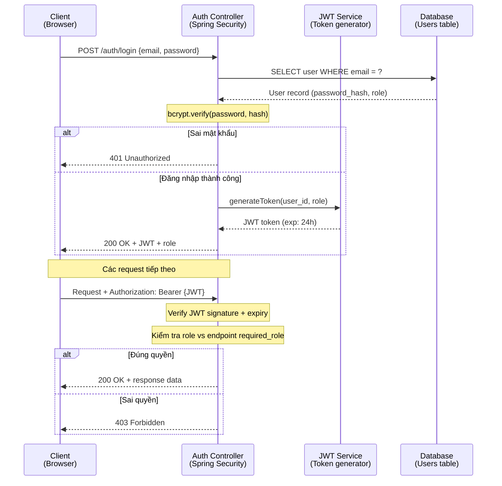
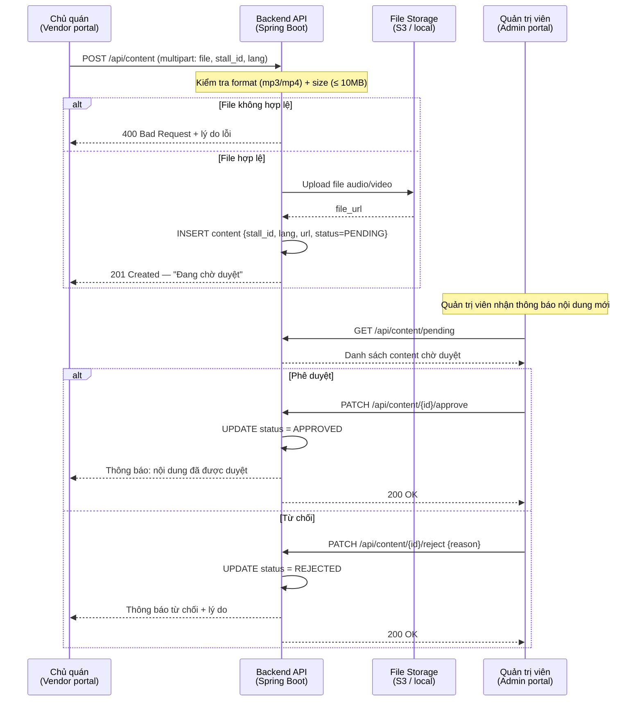
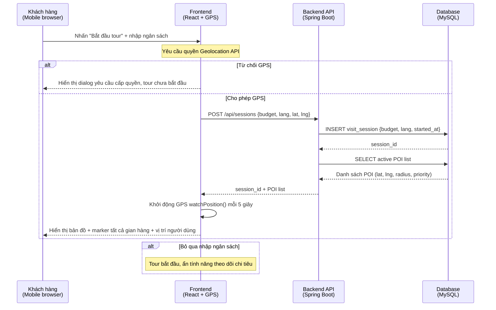
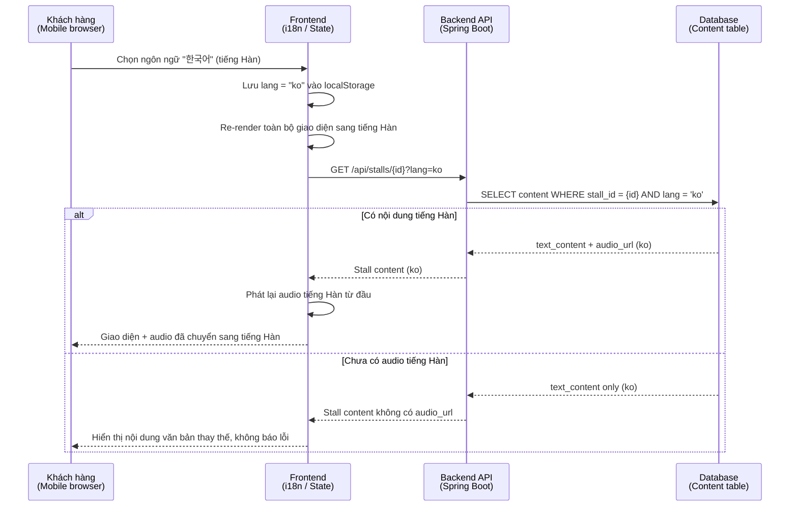
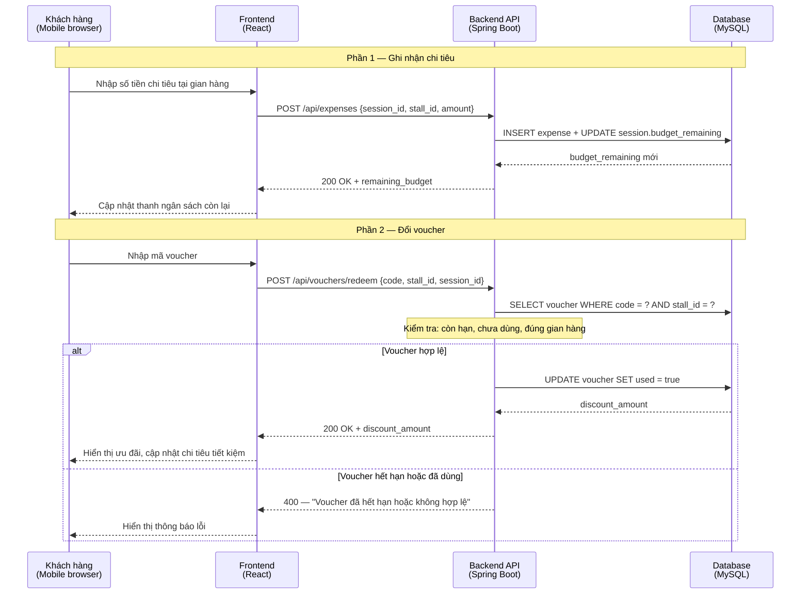
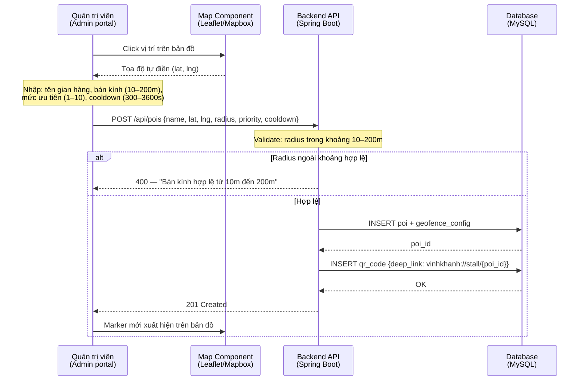
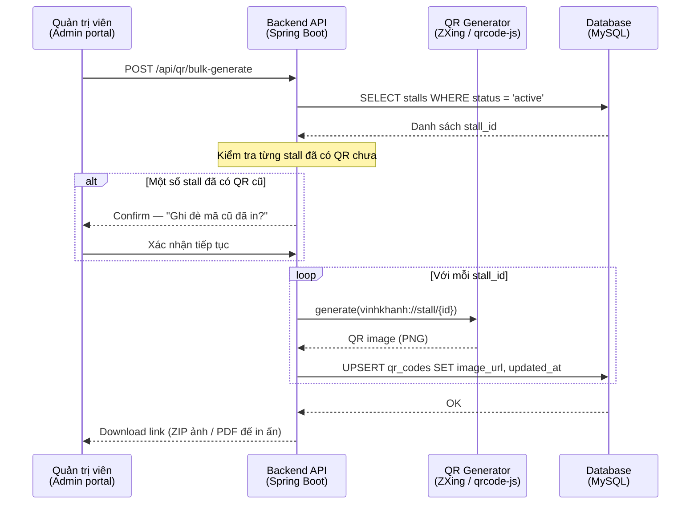
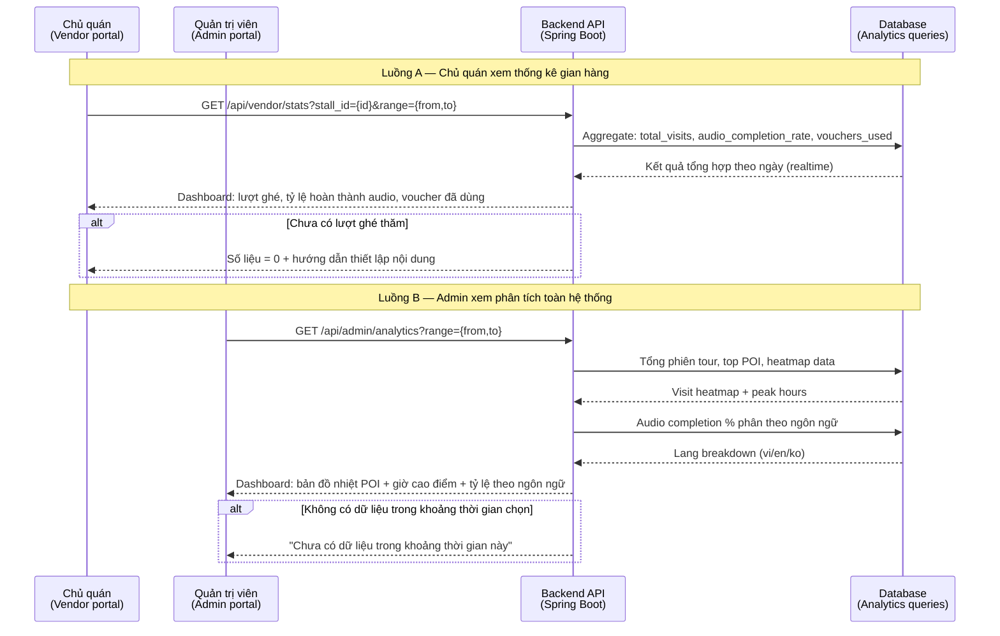

# 4.3. Sơ đồ Sequence

Mục này trình bày các sơ đồ tuần tự (Sequence Diagram) mô tả luồng tương tác giữa các thành phần trong hệ thống thuyết minh tự động phố ẩm thực Vĩnh Khánh. Mỗi sơ đồ tương ứng với một kịch bản sử dụng quan trọng đã được đặc tả trong PRD.

---

## SD-01 — Kích hoạt audio tự động qua GPS / Geofencing

---

## SD-02 — Quét mã QR

---

## SD-03 — Đăng nhập và phân quyền JWT

---

## SD-04 — Chủ quán tải nội dung và kiểm duyệt

---

## SD-05 — Bắt đầu tour và hiển thị bản đồ

---

## SD-06 — Chuyển đổi ngôn ngữ (Việt / Anh / Hàn)

---

## SD-07 — Theo dõi chi tiêu và đổi voucher

---

## SD-08 — Quản trị viên thêm và cấu hình POI

---

## SD-09 — Quản trị viên tạo mã QR hàng loạt

---

## SD-10 — Xem thống kê (chủ quán và quản trị viên)

