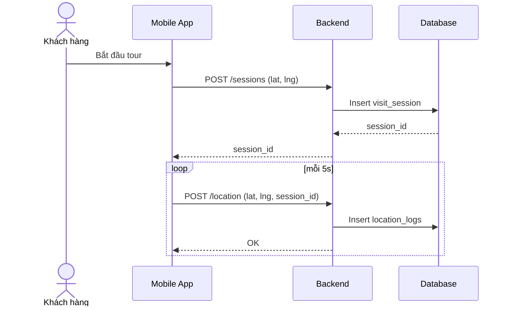
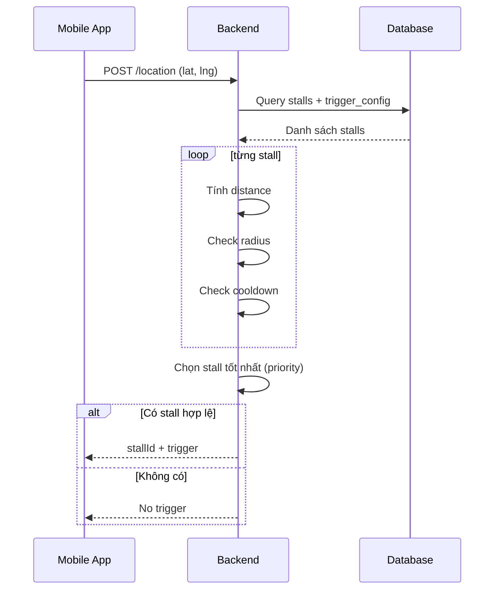
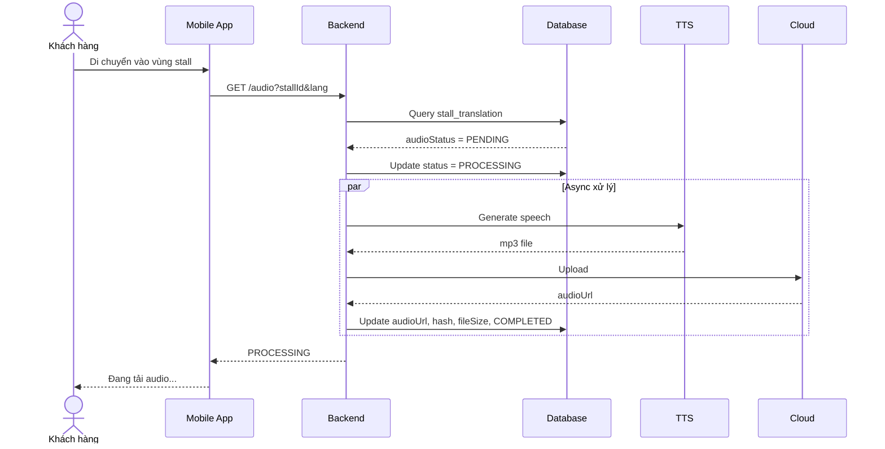
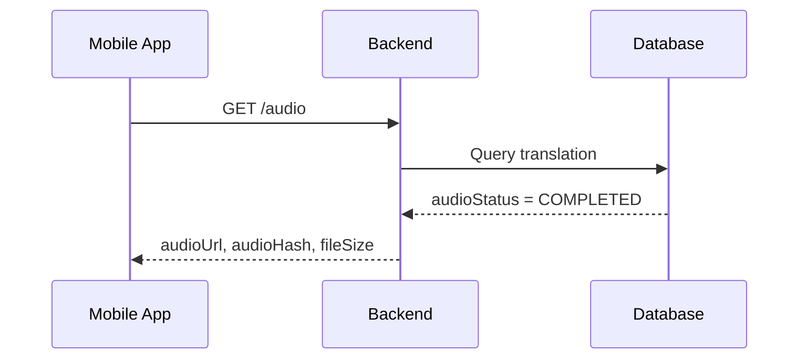
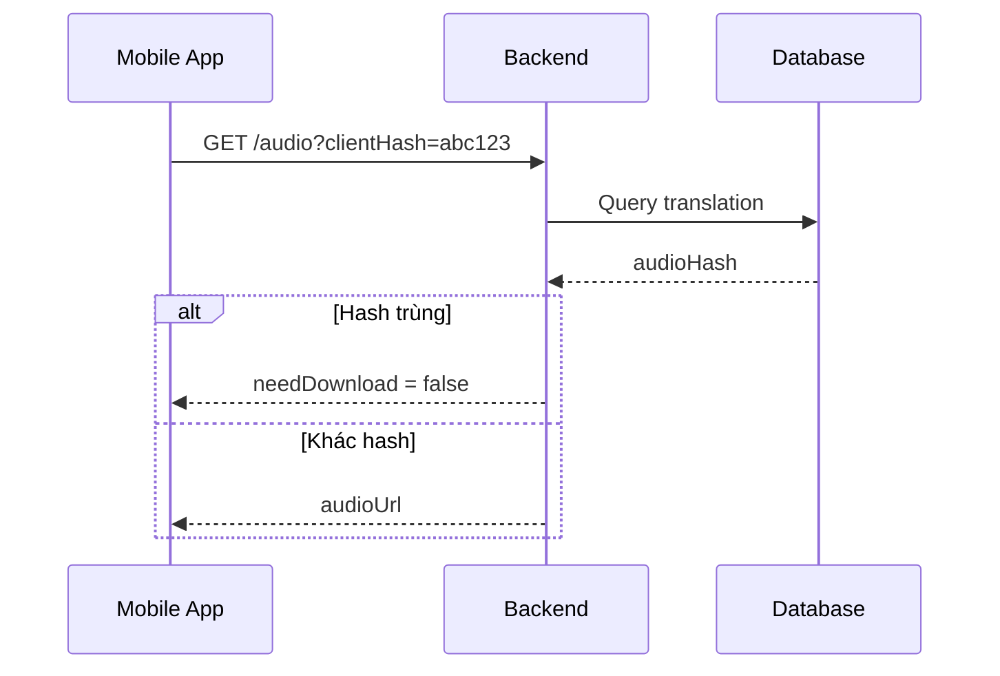
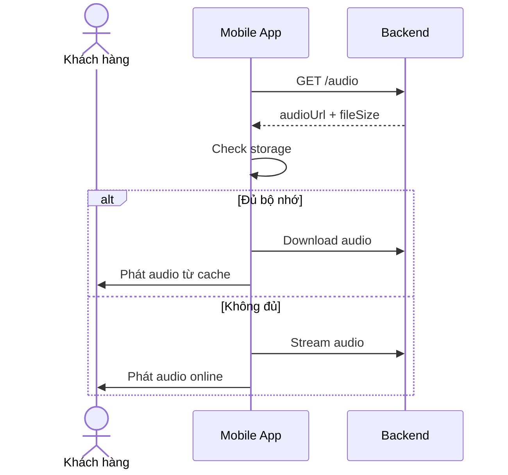
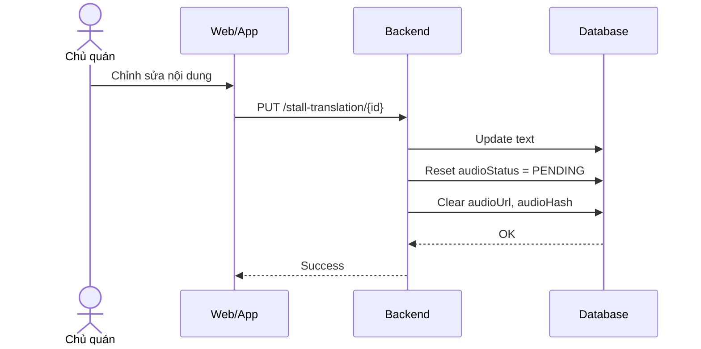
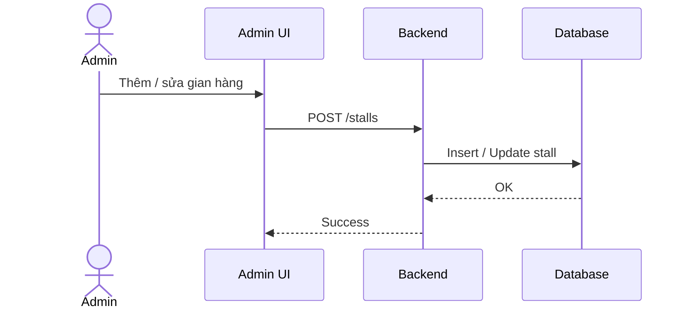
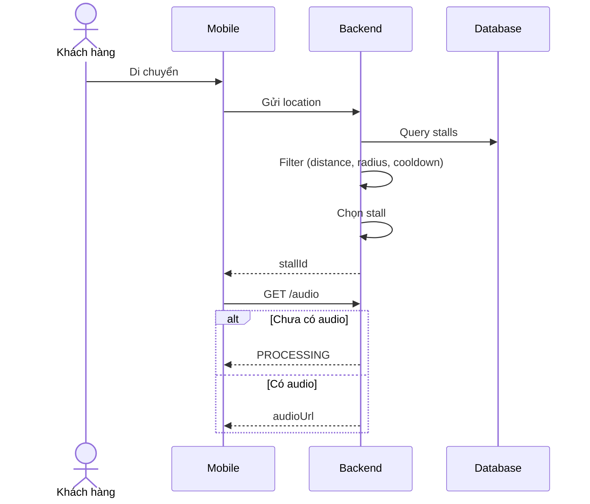
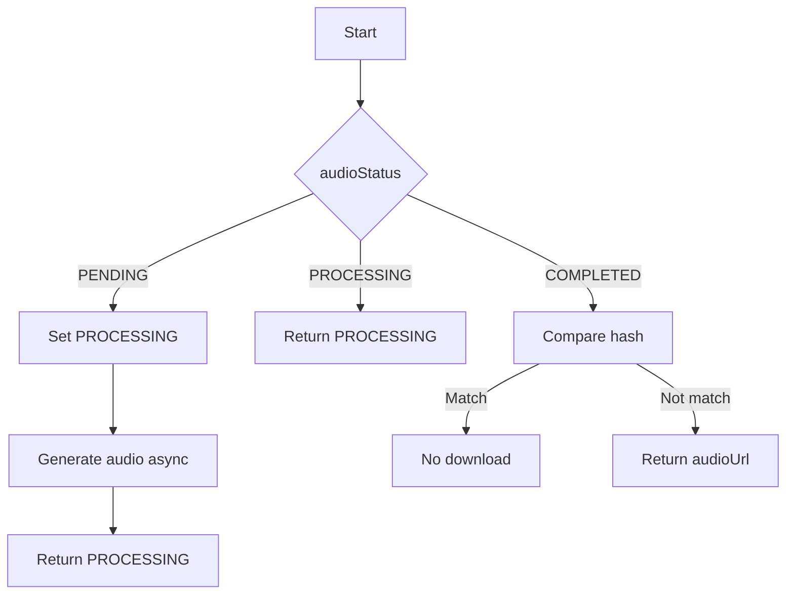

# 4.3. Sơ đồ Sequence (Final - Chuẩn theo hệ thống)

---

## SD-01 — Bắt đầu phiên tham quan + GPS tracking

---

## SD-02 — Xác định stall gần nhất (trigger logic)

---

## SD-03 — Lấy audio (CASE 1: chưa có audio)

---

## SD-04 — Lấy audio (CASE 2: đã có audio)

---

## SD-05 — Cache audio (CASE 3: zero latency)

---

## SD-06 — Download hoặc stream audio

---

## SD-07 — Chủ quán cập nhật nội dung (reset audio)

---

## SD-08 — Admin quản lý gian hàng

---

## SD-09 — Luồng tổng hợp (GPS → Audio)

---

# 4.4. Activity Diagram — Audio Processing

