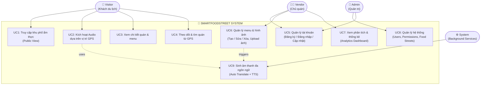
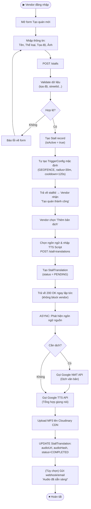
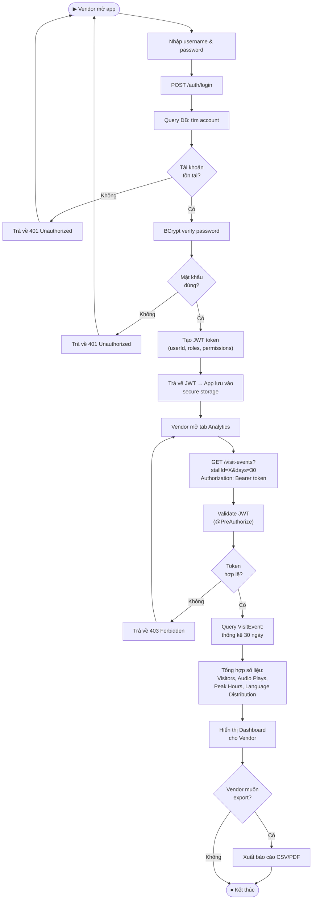
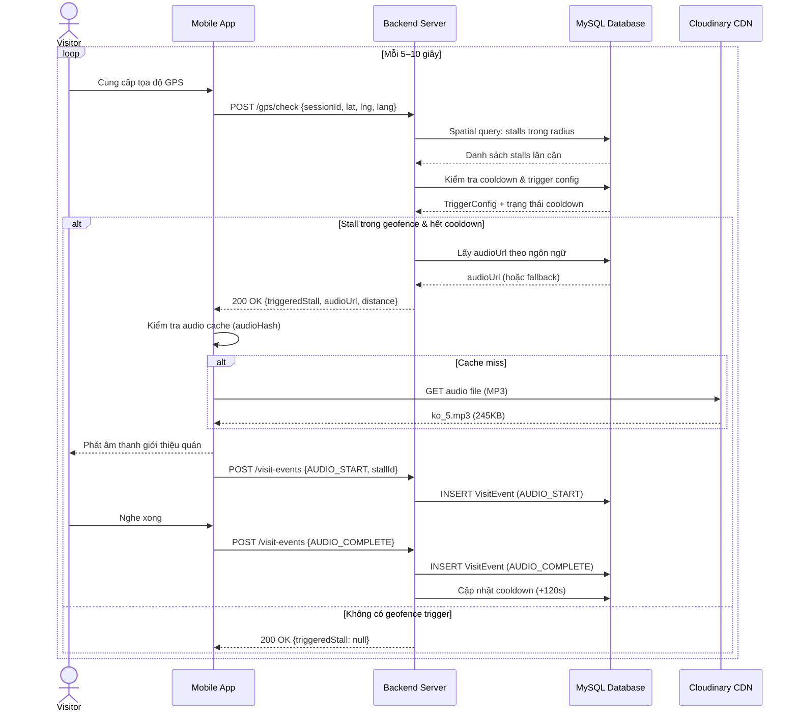
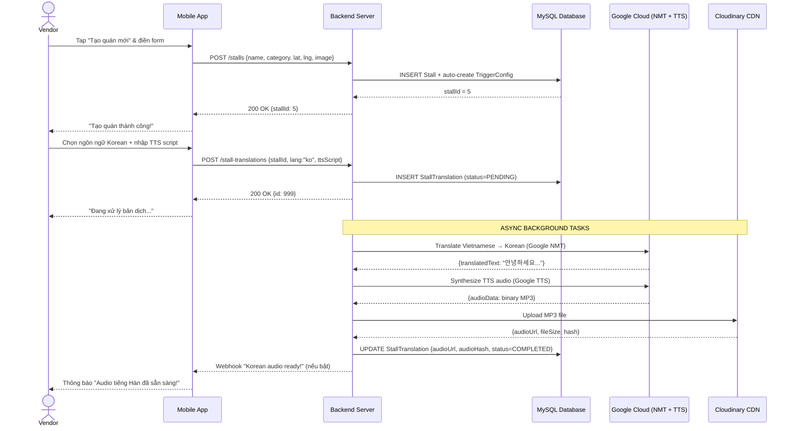
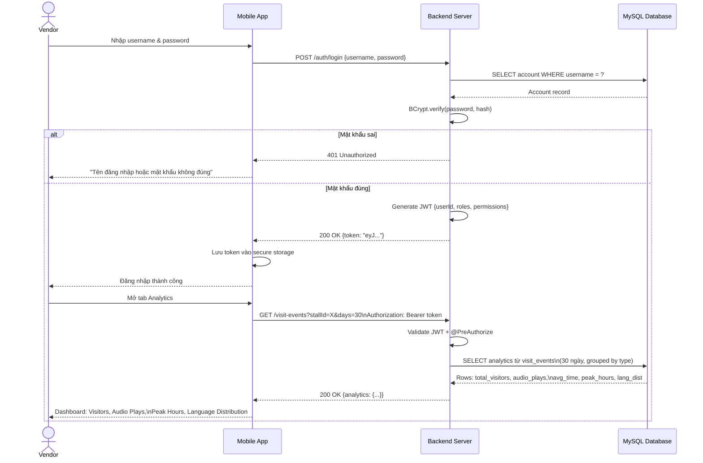
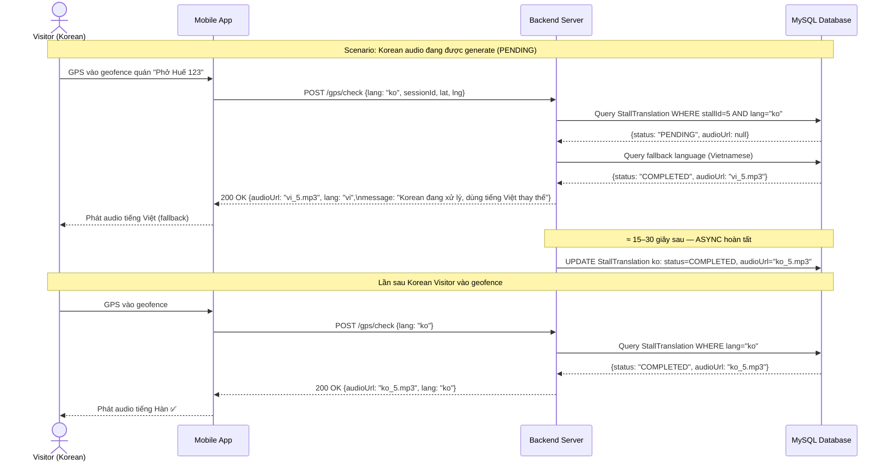

# SmartFoodStreet – Sơ đồ hệ thống (Mermaid)

> **Mở trong**: [Mermaid Live Editor](https://mermaid.live) để xem trực quan.

---

## 1. Use Case Diagram



---

## 2. Activity Diagram – Kích hoạt Audio theo GPS (UC2)

```mermaid
flowchart TD
    Start(["▶ Visitor mở app"])
    A["App yêu cầu vị trí GPS"]
    B{GPS bật?}
    C["Hiển thị 'Vui lòng bật GPS'"]
    D["Tạo VisitSession\n(status = ACTIVE)"]
    E["App gửi GPS location\nmỗi 5–10 giây\nPOST /gps/check"]
    F["Server tính khoảng cách\nđến các stall lân cận"]
    G{Stall trong\ngeofence/radius?}
    H{Cooldown\n(120s) đã hết?}
    I["Bỏ qua – chờ đến lần\ngửi GPS tiếp theo"]
    J["Lấy audio URL\ntheo ngôn ngữ ưu tiên"]
    K{Audio đã\nCOMPLETED?}
    L["Trả về audio URL\n(preferred language)"]
    M["Trả về fallback audio\n(Vietnamese/English)"]
    N["App nhận response\n– tải hoặc cache audio"]
    O["Phát âm thanh\ngiới thiệu quán"]
    P["Log VisitEvent:\nAUDIO_START"]
    Q["Âm thanh kết thúc"]
    R["Log VisitEvent:\nAUDIO_COMPLETE"]
    S["Cập nhật cooldown\n(+120 giây)"]
    T(["⏹ Tiếp tục tracking GPS"])

    Start --> A --> B
    B -->|Không| C --> Start
    B -->|Có| D --> E --> F --> G
    G -->|Không| I --> E
    G -->|Có| H
    H -->|Chưa hết| I
    H -->|Đã hết| J --> K
    K -->|Có| L --> N
    K -->|Đang xử lý| M --> N
    N --> O --> P --> Q --> R --> S --> T --> E
```

---

## 3. Activity Diagram – Vendor tạo Stall & Audio đa ngôn ngữ (UC6)



---

## 4. Activity Diagram – Vendor Đăng nhập & Xem Analytics (UC5 + UC7)



---

## 5. Sequence Diagram – Visitor Nhận Audio Geofence (UC2)



---

## 6. Sequence Diagram – Vendor Tạo Stall & Sinh Audio (UC6)



---

## 7. Sequence Diagram – Vendor Đăng nhập & Xem Analytics (UC5 + UC7)



---

## 8. Sequence Diagram – Zero-Latency Audio Fallback (UC6 Special)


