# ACTIVITY DIAGRAMS (Mermaid)

---

## 1. UC1 - Bắt đầu tour

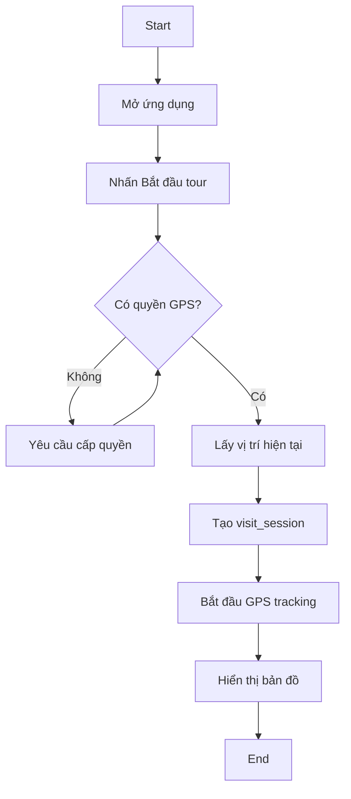

---

## 2. UC2 - Nhận audio tự động (Geofencing)

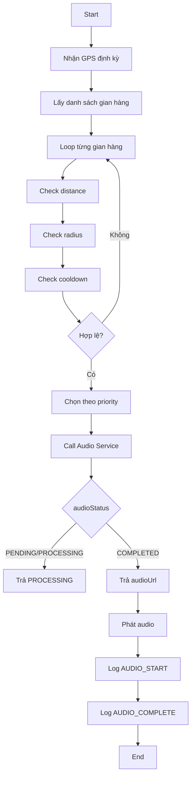

---

## 3. UC3 - Quét QR

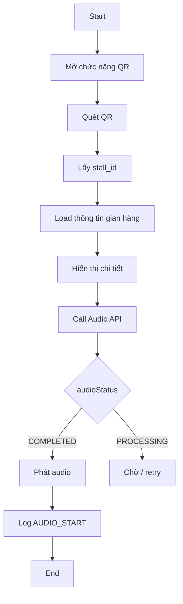

---

## 4. UC4 - Xem bản đồ

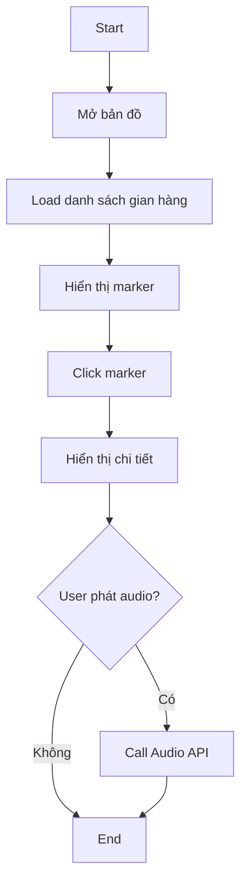

---

## 5. UC6 - Chuyển đổi ngôn ngữ

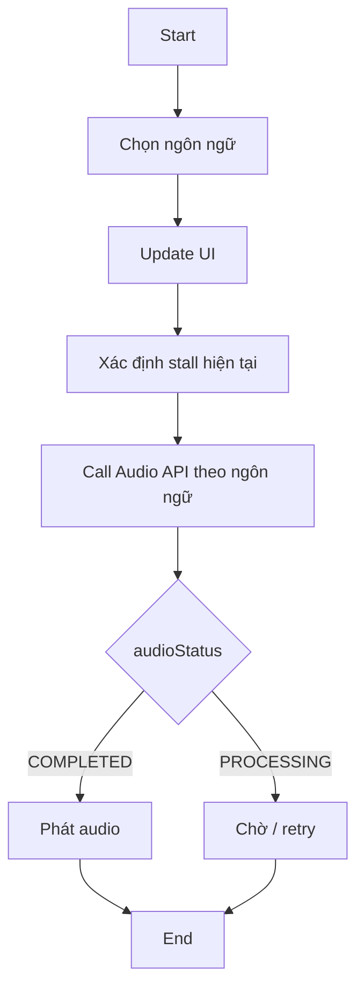

---

## 6. UC8 - Quản lý nội dung TTS (Vendor)

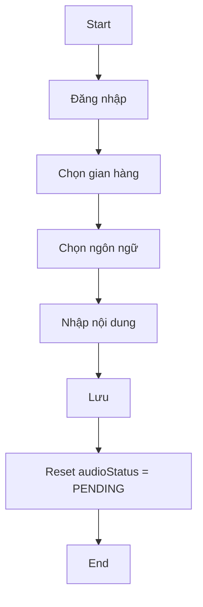

---

## 7. UC9 - Quản lý gian hàng + Geofencing

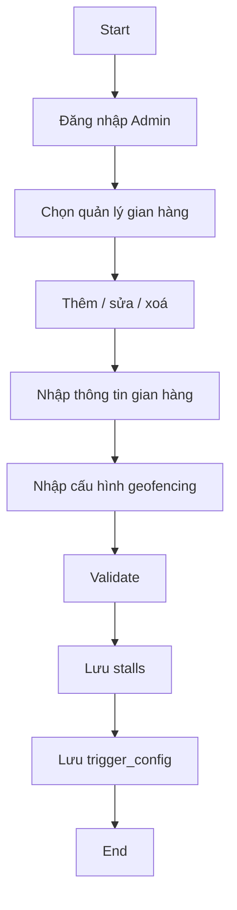

---

## 8. UC11 - Quản lý QR

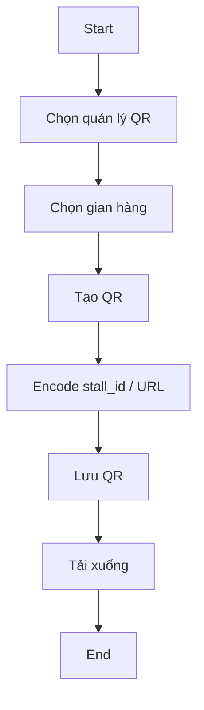

---

## 9. UC13 - Quản lý tài khoản

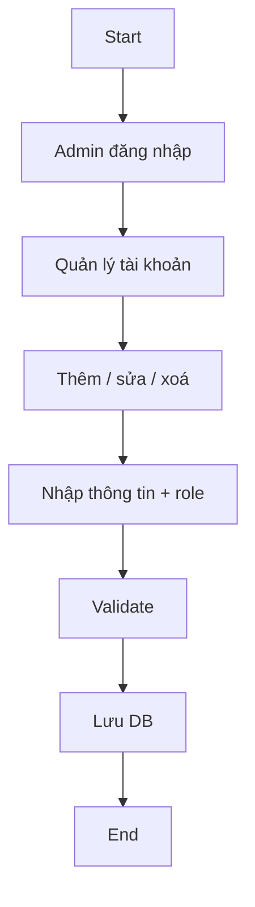

---

## 10. UC14 - Xem thống kê hệ thống

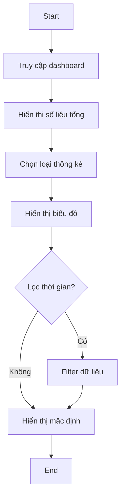

---

## 11. Activity Diagram tổng (Flow chính hệ thống)

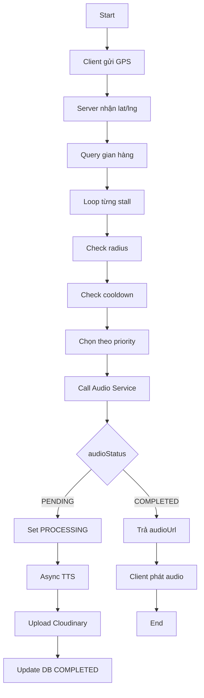
